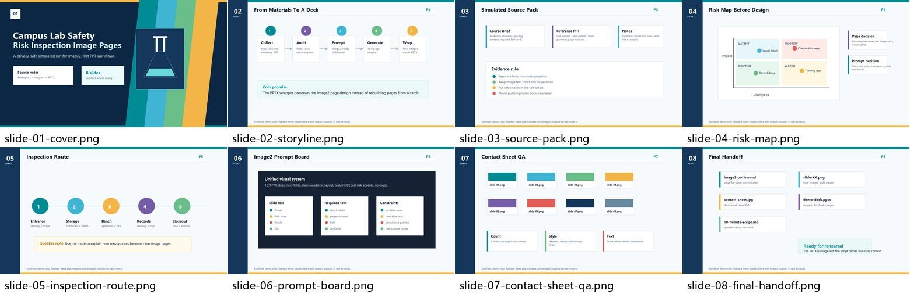
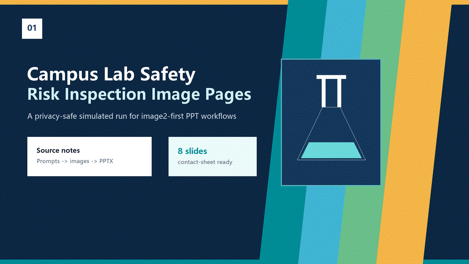

# PPT Image Share Builder

English | [简体中文](README.zh-CN.md)

[](https://github.com/uuoov/ppt-image-share-builder/releases)
[](LICENSE)
[](SKILL.md)
[](scripts/images_to_pptx.py)



Turn a course topic, source files, and a reference PPT style into an image2-first classroom presentation workflow:

- sourced slide outline
- per-slide image prompts
- high-quality slide images generated with image2 or another raster image model
- contact-sheet QA
- PPTX assembled from the generated images
- timed presentation script
- revision notes from user feedback

This is a Codex skill for students, teachers, researchers, and anyone who needs to make a polished lecture-style or report-style PPT from messy materials.

The core idea is simple:

```text
source files + reference PPT style
  -> image2-ready per-slide prompts
  -> generated 16:9 PPT page images
  -> contact sheet QA
  -> full-bleed PPTX assembled from those images
  -> timed speaking script
```

The helper scripts do not replace image2. They help after image generation: checking the image set and inserting final PNG/JPG pages into a `.pptx` deck.

## Why This Skill Exists

Most AI deck workflows stop too early:

1. They summarize the source.
2. They generate a few pretty slides.
3. They leave the user to fix structure, visual consistency, citations, and the speaking script.

`ppt-image-share-builder` packages a fuller workflow:


The skill is especially useful when the user has:

- a course topic
- a textbook excerpt or `.docx`
- pasted notes
- government/regulatory source material
- a sample PPT whose style should be followed
- a target speaking duration such as 8-10 minutes

## What It Produces

Typical output:

```text
<topic>_image2逐页大纲.md
<topic>_10分钟汇报稿.md
<topic>.pptx
outputs/<topic-slug>-images/
  slide-01-cover.png
  slide-02-contents.png
  ...
  slide-13-closing.png
  contact-sheet-13-slides.jpg
```

The exact filenames can be adapted to the project language and topic.

## Demo

The repository includes a privacy-safe synthetic demo. Its `images/` folder is a stand-in for real image2 outputs, so the repo can show the handoff without publishing private course material.

- [input notes](examples/lab-safety-check/input-notes.md)
- [image2 outline](examples/lab-safety-check/image2-outline.md)
- [generated image overview](examples/lab-safety-check/contact-sheet-demo.jpg)
- [sample talk script](examples/lab-safety-check/10-minute-script.md)



## Install

### Skill Installer

If your Codex environment includes the built-in skill installer, use:

Windows PowerShell:

```powershell
python "$env:USERPROFILE\.codex\skills\.system\skill-installer\scripts\install-skill-from-github.py" --repo uuoov/ppt-image-share-builder --path . --name ppt-image-share-builder
```

macOS / Linux:

```bash
python ~/.codex/skills/.system/skill-installer/scripts/install-skill-from-github.py --repo uuoov/ppt-image-share-builder --path . --name ppt-image-share-builder
```

Restart Codex so it loads the new skill metadata.

### Manual Clone

Clone this repository directly into your Codex skills directory.

Windows PowerShell:

```powershell
git clone https://github.com/uuoov/ppt-image-share-builder.git "$env:USERPROFILE\.codex\skills\ppt-image-share-builder"
```

macOS / Linux:

```bash
git clone https://github.com/uuoov/ppt-image-share-builder.git ~/.codex/skills/ppt-image-share-builder
```

### Release Download

You can also download the latest release ZIP from [GitHub Releases](https://github.com/uuoov/ppt-image-share-builder/releases).

### Development Install

If you are editing the skill locally, clone it anywhere and symlink or copy the folder into your Codex skills directory.

## Quick Start

Invoke the skill explicitly:

```text
Use $ppt-image-share-builder to turn my course topic, source files, and reference PPT style into slide image prompts, generated slide images, and a 10-minute presentation script.
```

A strong request usually includes:

```text
Topic: <your sharing topic>
Audience: <class / teacher / meeting>
Duration: <8-10 minutes>
Reference PPT: <path to sample deck>
Sources: <docx/pdf/txt/web links>
Required keywords: <terms that must appear>
Output: image prompts + slide images + PPTX + script
```

## Example Prompt

```text
Use $ppt-image-share-builder.

I need a 10-minute classroom report about a regulation topic.
I have a reference PPT in the current folder and a textbook excerpt as a .docx file.
Please:
1. extract the source material,
2. audit the reference PPT style,
3. create a 12-14 page image2 outline,
4. generate the first 3 slide images for style confirmation,
5. continue after I approve,
6. make a contact sheet,
7. write the final talk script.
```

## Helper Scripts

The commands below are PowerShell-safe. On Windows PowerShell 5.x, run multi-step commands on separate lines instead of joining them with `&&`.

After image2 has generated numbered slide images, create a contact sheet:

```powershell
python scripts/make_contact_sheet.py --input-dir examples/lab-safety-check/images -o examples/lab-safety-check/contact-sheet-demo.jpg
```

Generate the privacy-safe demo placeholder images, contact sheet, README preview image, and GIF:

```powershell
python scripts/create_demo_assets.py
```

Insert final image2-generated slide images into a full-bleed PPTX:

```powershell
python -m pip install python-pptx
python scripts/images_to_pptx.py --input-dir examples/lab-safety-check/images -o examples/lab-safety-check/demo-deck.pptx
```

## Workflow Details

The skill follows these stages:

1. **Collect inputs**  
   Topic, audience, duration, slide count, reference PPT, source files, and must-use keywords.

2. **Extract and normalize sources**  
   Chinese `.docx`, `.txt`, `.csv`, and government-style documents are normalized before analysis. The skill warns against Windows PowerShell path-encoding pitfalls.

3. **Audit reference PPT style**  
   It extracts slide rhythm, title style, colors, fonts, page markers, chart/table style, and image language.

4. **Build the narrative spine**  
   It creates slide claims rather than just topic labels.

5. **Write image prompts**  
   It creates one unified visual prompt plus per-slide prompts with required text and composition.

6. **Generate and save slide images with image2**  
   It generates one slide at a time or in small batches, then saves stable numbered files. Treat these images as the visual source of truth for the final PPTX.

7. **QA with contact sheets**  
   It checks slide count, visible text, page numbers, duplicate variants, and style consistency.

8. **Assemble the PPTX**  
   It inserts the final images as full-bleed slides, so the deck preserves the image2 visual design.

9. **Write the timed script**  
   It writes a report script that adds spoken bridges and supporting cases instead of just reading the slides.

## Repository Layout

```text
ppt-image-share-builder/
  SKILL.md
  README.md
  README.zh-CN.md
  agents/
    openai.yaml
  assets/
    hero-contact-sheet.jpg
    demo.gif
  examples/
    lab-safety-check/
      input-notes.md
      image2-outline.md
      contact-sheet-demo.jpg
      10-minute-script.md
  references/
    workflow-checklist.md
    prompt-patterns.md
    qa-checklist.md
  scripts/
    create_demo_assets.py
    make_contact_sheet.py
    images_to_pptx.py
```

## Design Principles

- **Source-backed first**: facts, laws, dates, statistics, and cases should be tied to source notes.
- **Reference-style aware**: generated slides should match the user's existing PPT language.
- **Human-in-the-loop**: generate a few slides first, confirm the style, then continue.
- **Chinese text aware**: keep generated Chinese text short enough to inspect and fix.
- **Private by default**: do not publish user textbooks, generated course files, personal names, or classroom materials unless the user explicitly asks.

## Scope

This is a focused skill for image2-first classroom and report-style presentation workflows. It is meant for:

- turning source material into image2-ready slide prompts
- generating polished 16:9 slide images
- checking the whole image deck with a contact sheet
- assembling the final images into a PPTX
- writing a timed speaking script

## Current Features

- Privacy-safe demo project with input notes, image2-style prompts, placeholder slide images, contact sheet, and talk script.
- Contact sheet generator for quick QA after image2 generation.
- PPTX assembly helper that inserts image2-generated slides into full-bleed PPT pages.
- README preview image and animated GIF.
- Release ZIP for manual download.
- PowerShell-safe command examples for Windows users.

## Feedback

- Use [Issues](https://github.com/uuoov/ppt-image-share-builder/issues) for bugs, install problems, or script failures.
- Use [Discussions](https://github.com/uuoov/ppt-image-share-builder/discussions/1) for demo ideas, classroom use cases, and prompt-pattern feedback.

## License

MIT. See `LICENSE`.
