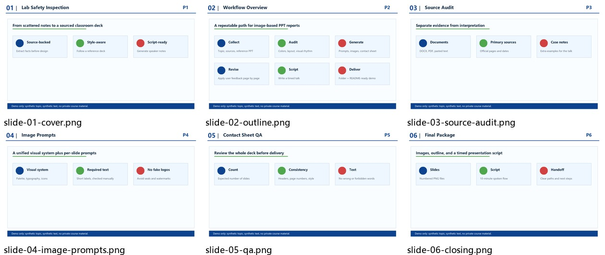

# Demo: Lab Safety Inspection

This is a privacy-safe demo that shows what `ppt-image-share-builder` is meant to produce.

The topic, sources, slide images, and script are synthetic. They do not contain private classroom materials, real student names, or unpublished files.

## Files

- `input-notes.md`: fake source notes
- `image2-outline.md`: sample per-slide outline and prompt plan
- `10-minute-script.md`: sample timed talk script
- `images/`: generated demo slide images
- `contact-sheet-demo.jpg`: overview of the generated slides

## Preview

