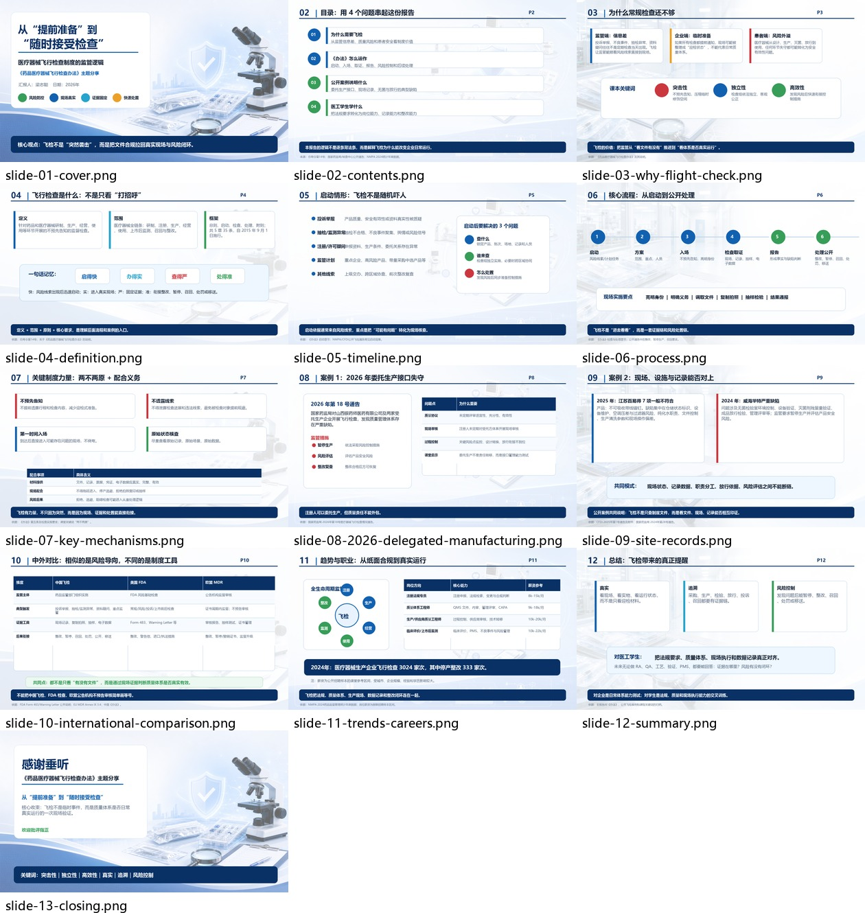

# Demo: Medical Device Flight Check

This is a real end-to-end demo run for `ppt-image-share-builder`.

The topic is a Chinese classroom report on the regulatory logic of medical-device unannounced inspections. The run used public regulatory cases plus a desensitized classroom source extract, generated medical-regulation visual assets with image2, composed source-backed Chinese report content into full 16:9 page images, then wrapped the final image set in PPTX.

```text
source extract + public cases
  -> image2-ready outline
  -> source-backed page content
  -> image2 visual assets
  -> final content-rich PPT page images
  -> contact sheet QA
  -> PPTX wrapper
  -> 10-minute talk script
```

## Files

- `image2-outline.md`: page-by-page prompt and source plan
- `report-content.md`: page-by-page report content and sources
- `10-minute-script.md`: timed Chinese presentation script
- `images/`: final full-page PPT images
- `visual-assets/`: bundled image2 visual backgrounds used by the content demo
- `contact-sheet-demo.jpg`: overview for deck-level QA
- `demo-deck.pptx`: full-bleed PPTX wrapper around the final images

## Preview


